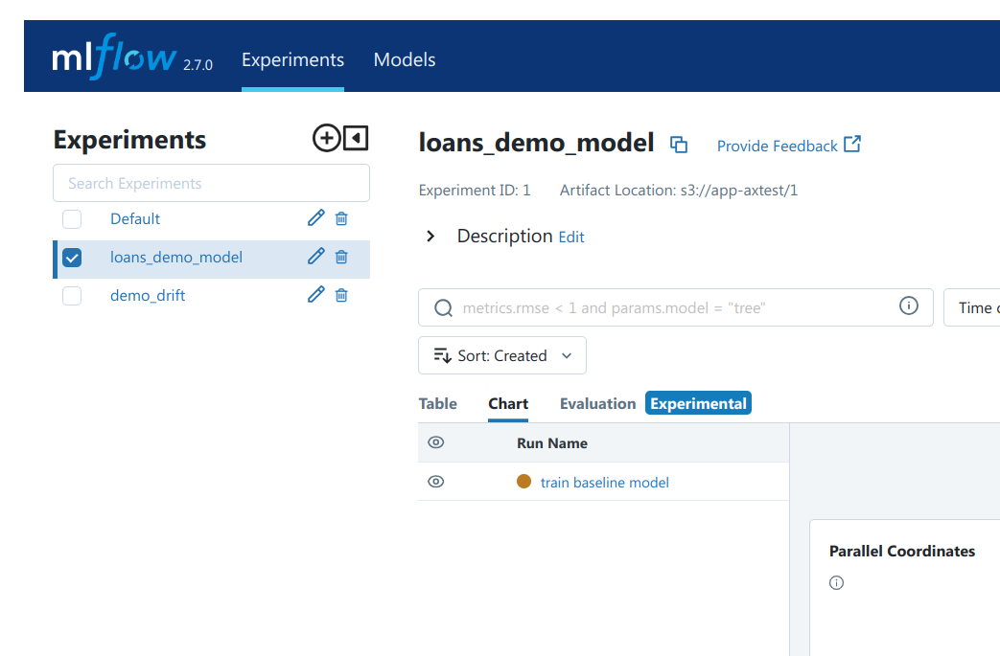
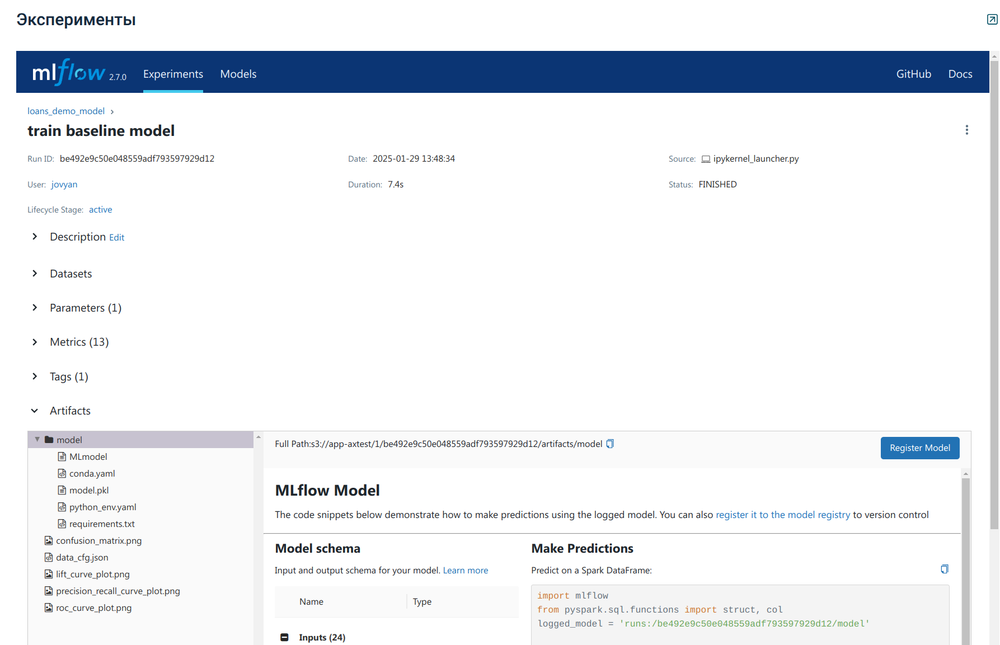
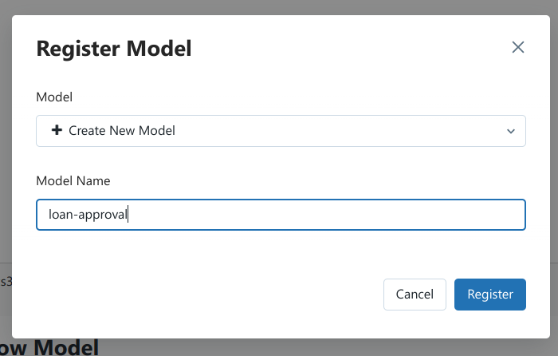
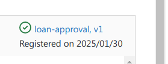

1. Обучение модели и регистрация эксперимента в MLflow
В Jupyter Notebook нужно выполнить следующие блоки кода. При работе на платформе Neoflex Dognauts настройка окружения для работы с MLflow происходит автоматически. Дополнительных действий не требуется

   1. Создание эксперимента MLflow
      ```python
      mlflow.set_experiment("loans_demo_model")
      ```

   1. Создание запуска
      ```python
      with mlflow.start_run(run_name='train baseline model') as current_run:
      ```
   1. Логирование модели и артефактов (внутри запуска)
      1.  Логируем модель
          ```python
          model.fit(x_train, y_train)
          ```
          ```python
          model_without_wrapper = mlflow.sklearn.log_model(
            model, "model",  
            conda_env=conda_env,
          )
          ```
          В данном примере мы дополнительно указывае conda-окружение (можно и не указывать, тогда mlflow  соберет его автоматически)
          ```python
                           conda_env={
                       'channels': ['defaults'],
                       'dependencies': [
                         'python=3.8.10',
                         'pip',
                         {
                           'pip': [
                             'mlflow<3,>=2.2',
                             'numpy==1.23.4',
                             'scikit-learn=={}'.format(sklearn.__version__),
                             'joblib=={}'.format(joblib.__version__),
                             'dill=={}'.format(dill.__version__),
                           ],
                         },
                       ],
                       'name': 'demo_env'
                   }
          ```
        
      1. Логируем метрики модели
         ```python
         thresholds = {
             "accuracy_score": MetricThreshold(
                 threshold=0.05,
                 higher_is_better=True,
             ),
         }
         ```

         ```python
         result = mlflow.evaluate(
            model_without_wrapper.model_uri,
            training_df,
            targets=target,
            model_type="classifier",
            evaluators=["default"],
            validation_thresholds=thresholds,
         )
         ```
      1. Логируем параметры обучения модели
         ```python
         n_estimators = 100
         ```
         ```python
         mlflow.log_param("n_estimators", n_estimators)
         ```
      1. Логируем произвольный файл
         ```python
         data_cfg_name = "data_cfg.json"
        
         data_cfg = {
            'type': 'feast_dataset',
            'fs_path': ".",
            'dataset_path': dataset_name,
            'categorical_features': categorical_features,
            'cols_to_drop': cols_to_drop,
         }
        
         with open(data_cfg_name, 'w') as fp:
            json.dump(d
         ```
         ```python
         mlflow.log_artifact(data_cfg_name)
         ```
      1. Добавляем тег
         ```python
         dataset_name = "loan_approval_baseline"
         ```
         ```python
         mlflow.set_tag('base_dataset', dataset_name)
         ```
      1. В результате в MLflow проекта появляется эксперимент loans_demo_model и запуск train baseline model в нём:
      
      
    
      1. Переходим в запуск, в котором можно посмотреть всю ранее залогированную информацию, например параметры, метрики и артефакты. Справа от артефактов нужно нажать кнопку «Register model»
    
      
    
      1. Далее выбрать пункт «Register new model» и указать имя модели и нажать Register.
    
      
    
      1. Вместо кнопки появится информация о зарегистрированной модели
    
      
    
      1. На этом регистрация модели в MLflow завершена!
