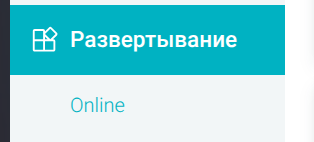
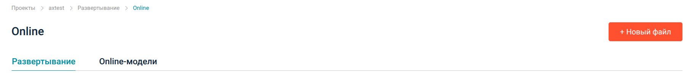
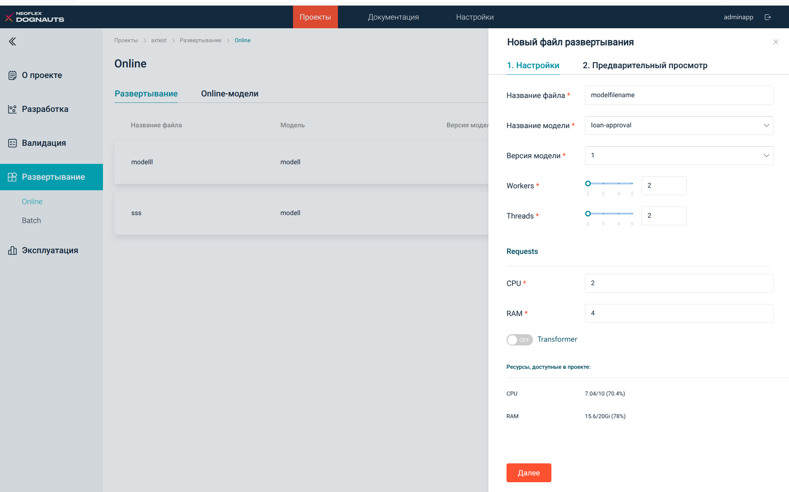
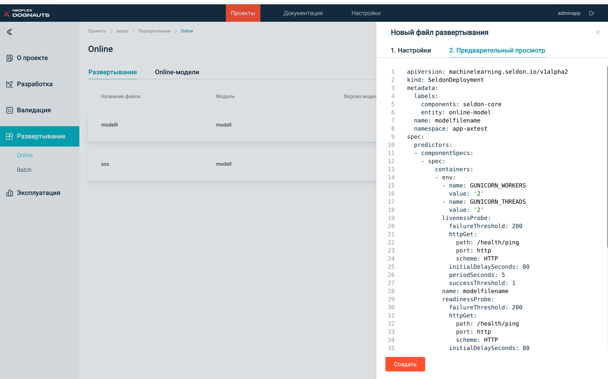
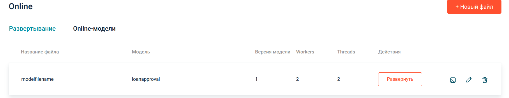
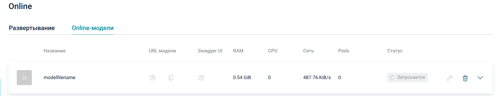
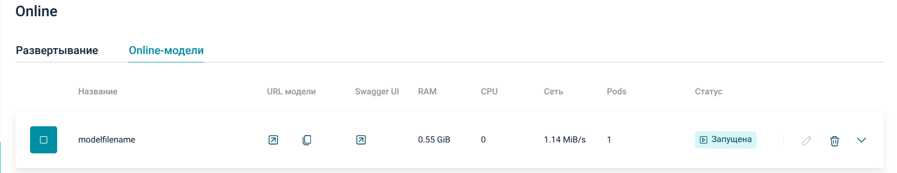
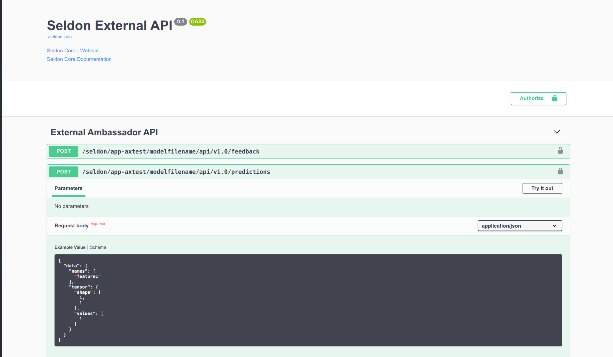

1. Зарегистрировать модель согласно сценария **0 MLflow**
1. В интерфейсе Neoflex Dognauts перейти на вкладку **Развертывание — Online**

1. Нажать кнопку **Новый файл**

1. В открывшемся визарде нужно указать имя нового файла деплоймента, выбрать модель и ее версию. Так же нужно указать ресурсы для модели  (CPU + RAM).

1. После этого нужно нажать кнопку «Далее» и проверить сгенерированный манифест.

1. Далее — нажать кнопку Создать. Новый манифест будет загружен в git репозиторий проекта в папку, указанную при включении компонента Seldon.
1. Для деплоя модели в кластер в качестчве REST микросервиса нужно в списке файлов деплоймента выбрать созданный файл и нажать кнопку **Развернуть**

1. После этого манифест SeldonDeployment будет отправлен в кластер k8s в NS проекта, на вкладке **Online-модели** появится модель начнется ее запуск в качестве микросервиса. Во время запуска отображается статус **Запускается** и элементы управления заблокированы (серые)

1. После завершения запуска элементы управления активируются (поменяют цвет) и статус поменяется на **Запущена**

1. Что бы проверить модельный сервис в работе нужно нажать кнопку Swagger UI, после чего откроется интерфейс Swagger

1. С помощью метода **predictions** можно отправлять модельному сервису запросы и получать ответы.
