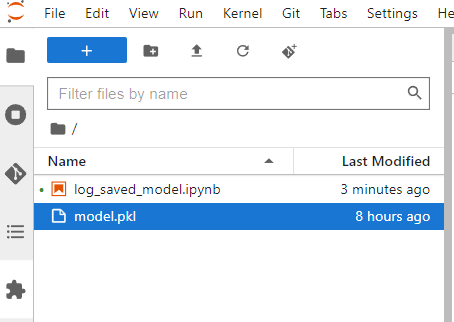
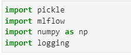
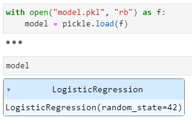
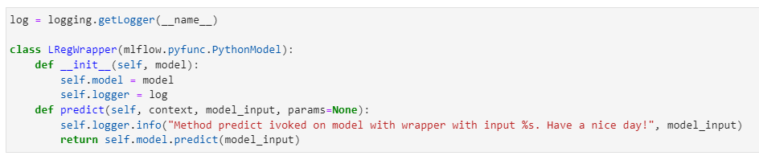
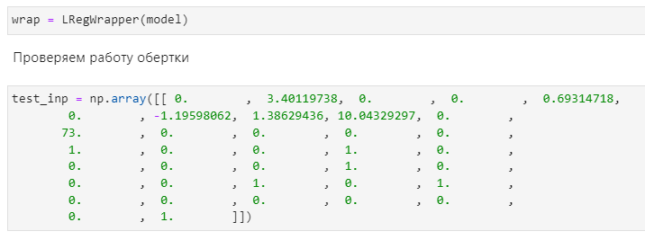
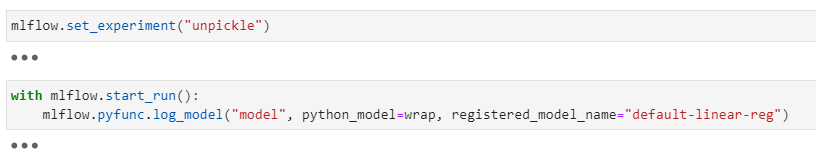
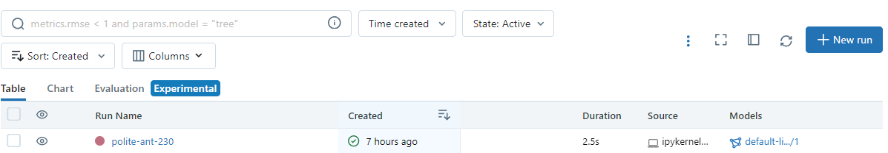

1. Для работы с вашими уже обученными модели, вам потребуется загрузить вашу модель в ноутбук любым удобным способом.

    

1. Импортируйте нужные библиотеки. Важно, чтобы в окружении присутствовали все библиотеки, которые требуются для работы вашей модели.

    

1. Загрузите вашу модель подходящим для нее способом, например:

   

1. Далее вам потребуется написать класс-обертку для вашей модели, если для ее исполнения требуется дополнительная логика (энкодинг), или ваша модель имеет вид, который не поддерживает mlflow (https://mlflow.org/docs/latest/python_api/index.html). 

    Для написания обертки создайте класс наследуясь от `mlflow.pyfunc.PythonModel` и опишите в нем как минимум 2 метода: `__init__` и `predict`. В методе `__init__` опишите все элементы нужные для применения вашей модели (модель, энкодер и тд.). В методе `predict` — логику применения.

   

1. Создайте объект класса вашей модели и проверьте его работоспособность.

   

1. Выберите или создайте эксперимент mlflow в который вы хотите сохранить вашу модель.
1. Создайте run.
1. Залогируйте вашу модель в mlflow  с помощью функции mlflow.pyfunc.log_model(). У
кажите папку, в которой будут хранится артефакты вашей модели. 
1. В параметре python_model укажите вашу обернутую модель. 
Так же можете сразу зарегистрировать свою модель в  mlflow чтобы выгружать ее по имени или задеплоить в Seldon (модель будет сохранена под новой версией).

    

    *Хорошим тоном будет добавить к логированию модели ее метрики и параметры обучения.*

1. После этого можете перейти в mlflow и найти run вашей модели.

    
